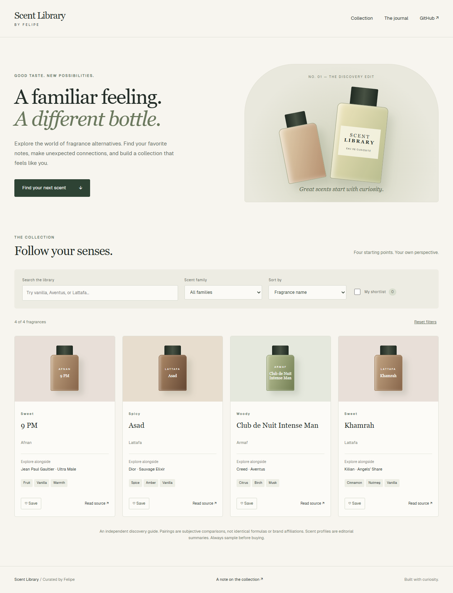

# Scent Library

An independent fragrance discovery library: explore familiar scent profiles, compare alternatives, and keep a personal shortlist.

**[Live demo](https://felimart2003.github.io/Fragrance-Clones-Website/)** · [Source](https://github.com/felimart2003/Fragrance-Clones-Website)

## Features

- Four source-linked editorial discovery pairings, searchable by fragrance, brand, reference, family, and notes.
- Scent-family filters, name/brand sorting, shareable URL filters, and useful empty states.
- A browser-local shortlist with graceful fallback when storage is blocked.
- Responsive editorial design, original CSS bottle illustrations, keyboard controls, labeled fields, and reduced-motion support.
- A journal explaining the collection and its limitations. No tracking or accounts.

## Run locally

Requires Node.js 20+. No dependencies or credentials are needed.

```sh
npm start
# Open http://127.0.0.1:4175
npm test
```

Serve over HTTP rather than opening the HTML directly: browser JavaScript modules require an HTTP origin.

## Architecture

- `index.html`: accessible page structure and controls.
- `catalog.js`: small checked-in dataset and pure filtering/sorting function.
- `script.js`: DOM rendering with `textContent`, URL state, and optional localStorage.
- `style.css`: responsive layout and original bottle illustrations.
- `about.html`: editorial methodology; `fragrances.html` preserves the old collection URL.
- `tools/serve.js`: dependency-free local preview server.

Add an item in `catalog.js` with a stable ID and HTTPS source link. Notes and pairings are editorial summaries, not brand claims or promises of equivalence. The catalog deliberately excludes volatile prices and invented ratings. Khamrah is presented as a related gourmand direction, not an exact clone.

## Validation and deployment

`npm test` verifies search normalization, combined family/shortlist filters, unique catalog IDs, and HTTPS sources. The GitHub Actions workflow runs these checks, publishes only public assets, and deploys to free GitHub Pages on every push to `main`. Select **GitHub Actions** as the Pages source in repository settings if creating a fork.

There is no backend, build dependency, API key, or environment configuration. Legacy placeholder Google Sheets authentication and invalid bare font imports were removed. Saved selections are device/browser specific and are cleared when browser data is deleted.


